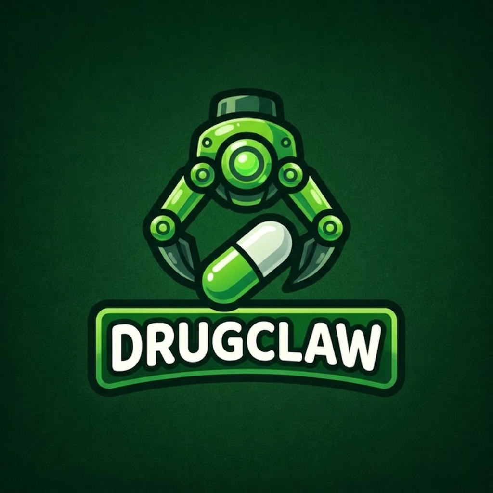
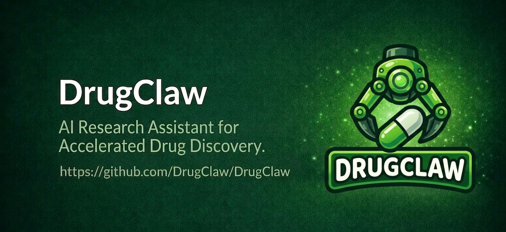
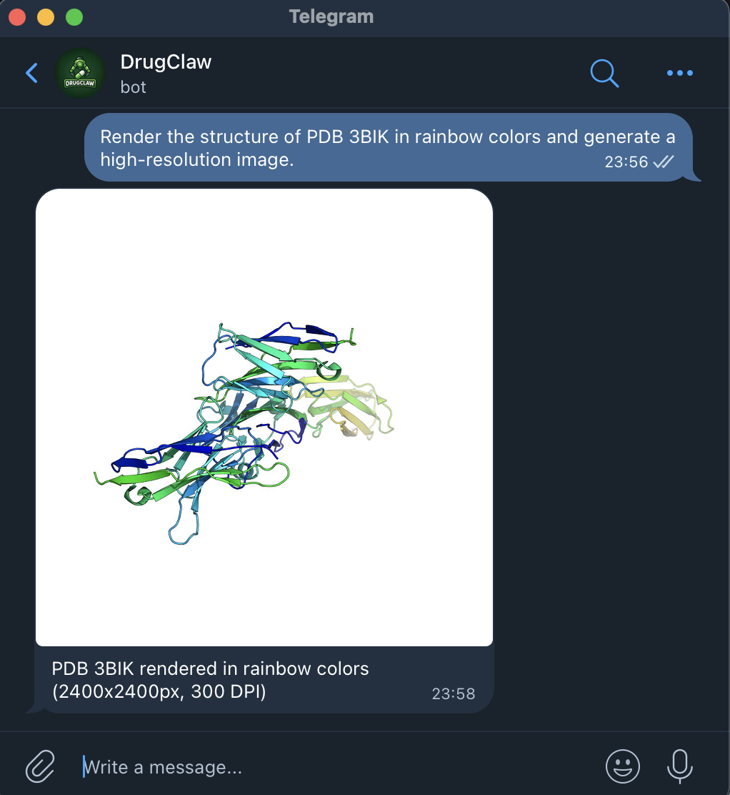
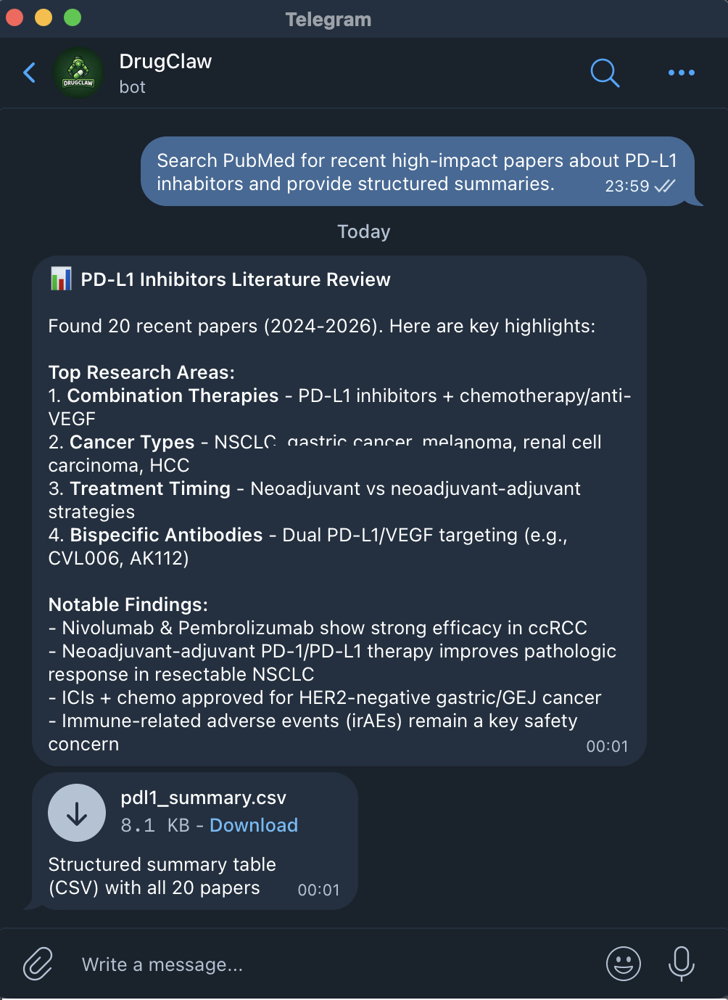
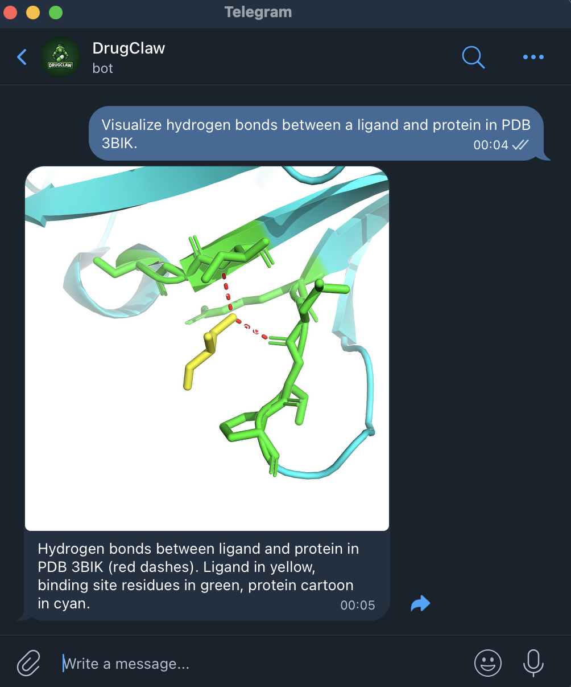
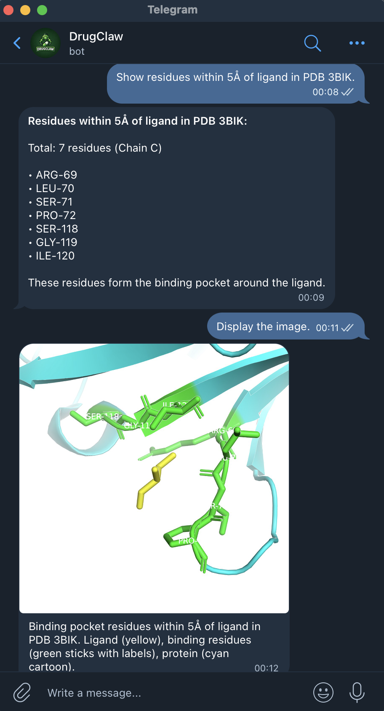
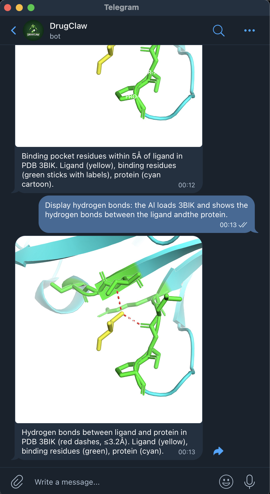
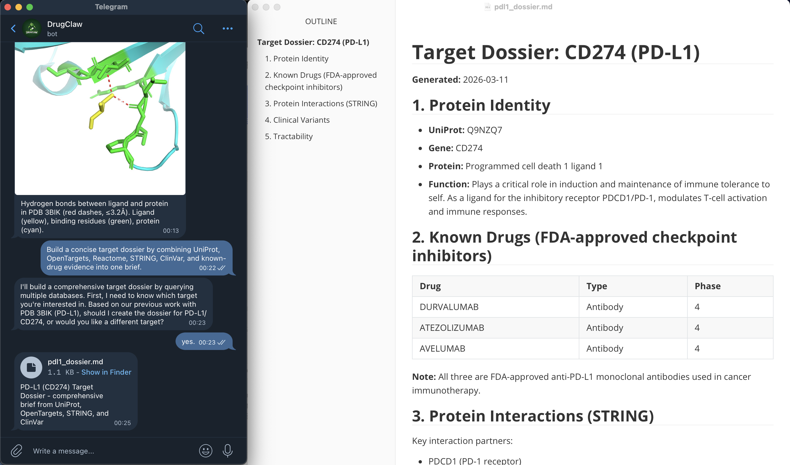
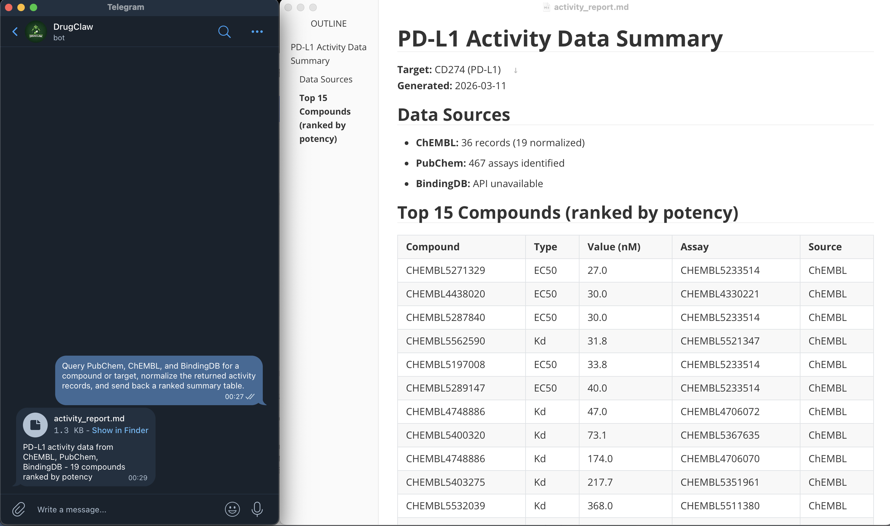
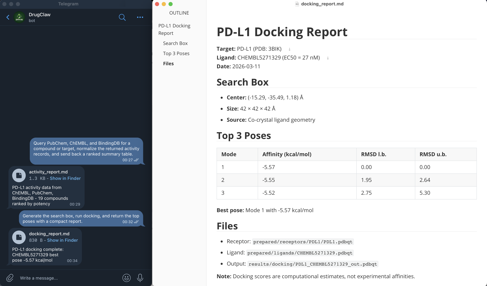

# DrugClaw


[English](README.md) | [中文](README_CN.md)

[](https://drugclaw.com)
[](LICENSE)

<p align="center">
  
</p>

DrugClaw 是一个面向加速药物发现的 AI Research Assistant，以 Rust 多渠道智能体运行时的形式实现。它把聊天渠道、本地 Web UI、HTTP hooks、定时任务和领域技能放进同一套 agent core，而不是拆成多个彼此割裂的 bot。

## Built with Rust. 🦀

本项目在 [microclaw](https://github.com/microclaw/microclaw) 的基础上构建。

## DrugClaw 是什么

DrugClaw 把药物发现研究工作流和通用 agent runtime 组合在一起：

- 渠道无关的 agent loop，支持工具调用与会话恢复
- provider 无关的 LLM 层，原生支持 Anthropic 与 OpenAI-compatible 后端
- 基于 SQLite 的持久化存储，用于聊天、记忆、鉴权与观测
- 面向运维和自动化的本地 Web UI 与 HTTP hook 接口
- 可复用技能系统，覆盖生信、化学与分子对接工作流

当前渠道适配器包括：

- Telegram
- Discord
- Slack
- Feishu / Lark
- Matrix
- WhatsApp Cloud API
- IRC
- iMessage
- Email
- Nostr
- Signal
- DingTalk
- QQ
- Web

## 当前范围

DrugClaw 现在已经适合作为：

- 一个可调用工具的聊天智能体
- 一个带 hooks 与定时任务的多聊天自动化运行时
- 一个带持久记忆的长期助手
- 一个可用于运营和排障的本地控制台
- 一个面向文献检索、公共数据库检索、分子性质分析、DrugBank、QSAR 与 docking 的研究助手

这套运行时本身足够通用，也能承载别的自动化任务，但产品方向明确聚焦在药物发现研究加速。

## 能力边界

DrugClaw 擅长：

- 文献与公共数据库检索
- 面向生物和化学产物的结构化整理
- 生信与计算化学的可复现脚本流程
- 通过 docking、ADMET、QSAR、结构型打分做启发式优先级排序
- 把聊天里的研究意图转成可落盘的分析产物、报告与后续任务

DrugClaw 不是：

- 湿实验自动化系统
- 药化或结构生物学专家判断的替代品
- 经过临床或监管验证的 ADMET / affinity 预测系统
- 诊断、治疗或监管决策系统
- 证明某个化合物在体外、体内或人体中有效的证据

当 DrugClaw 给出 docking 分数、QSAR 预测、ADMET 启发式或亲和力估计时，应把它们视为优先级排序信号，而不是实验事实。

## Prerequisites

- macOS 或 Linux
- Docker Desktop
- Anthropic API key

---

## Demo Examples

下面是 DrugClaw 通过 Telegram 处理真实任务的演示示例。

1. Protein Structure Rendering

> 获取一个 PDB 结构，用 PyMOL 按 rainbow coloring 渲染，并把图片发送回来。

<p align="center">
  
</p>

2. PubMed Literature Search

> 检索近期高影响力的 PubMed 论文，并输出结构化摘要。

<p align="center">
  
</p>

3. Hydrogen Bond Analysis

> 可视化 PDB 3BIK 中配体与蛋白之间的氢键。

<p align="center">
  
  
  
</p>

4. Target Intelligence Dossier

> 整合 UniProt、OpenTargets、Reactome、STRING、ClinVar 和已知药物证据，生成一份紧凑的靶点 dossier。

<p align="center">
  
</p>

5. Compound Database Triage

> 针对某个化合物或靶点检索 PubChem、ChEMBL 和 BindingDB，标准化活性记录，并返回排序后的摘要表。

<p align="center">
  
</p>

6. Docking Workflow Summary

> 生成 search box，执行 docking，并返回 top poses 和简洁报告。

<p align="center">
  
</p>

## 安装

### 一键安装

```sh
curl -fsSL https://drugclaw.com/install.sh | bash
```

如果本机装了 Docker 且 daemon 可用，安装脚本还会尝试自动构建默认科学 sandbox
镜像 `drugclaw-drug-sandbox:latest`。

### Windows PowerShell 安装

```powershell
iwr https://drugclaw.com/install.ps1 -UseBasicParsing | iex
```

### 从源码运行

```sh
git clone https://github.com/DrugClaw/DrugClaw.git
cd drugclaw
cargo build
npm --prefix web install
npm --prefix web run build
```

### 卸载

```sh
./uninstall.sh
```

## 快速开始

### 1. 创建配置文件

```sh
cp drugclaw.config.example.yaml drugclaw.config.yaml
```

### 2. 跑 setup 和 doctor

```sh
drugclaw setup
drugclaw doctor
```

如果本地已经准备好默认 sandbox 镜像，`drugclaw setup` 会默认把 bash sandbox
设为开启。

### 3. 启动运行时

```sh
drugclaw start
```

### 4. 打开本地 Web UI

默认地址是 `http://127.0.0.1:10961`。

## 最小配置示例

最实用的起点通常是先开 Web，再逐步加渠道。

```yaml
llm_provider: "anthropic"
api_key: "replace-me"
model: ""

data_dir: "./drugclaw.data"
working_dir: "./tmp"
working_dir_isolation: "chat"

channels:
  web:
    enabled: true
  telegram:
    enabled: false

web_host: "127.0.0.1"
web_port: 10961
```

建议继续补的几项：

- 在 `channels:` 下启用至少一个聊天渠道
- 设置 `soul_path` 或放置 `SOUL.md`
- 对代码执行开启 sandbox
- 用 `drugclaw web password-generate` 初始化 Web 侧操作员访问

## 核心概念

### Agent loop

DrugClaw 在所有渠道里遵循同一条主链路：

1. 加载聊天状态和记忆
2. 组装 system prompt 与技能目录
3. 调用模型并暴露工具 schema
4. 在模型请求时执行工具
5. 持久化新的会话和产物

共享循环位于 [src/agent_engine.rs](src/agent_engine.rs)。渠道只是收发适配层，不是独立 agent。

### 记忆系统

DrugClaw 有两层记忆：

- 文件记忆：`AGENTS.md` 与 `runtime/groups/` 下的聊天级文件
- 结构化记忆：SQLite 中的事实、置信度、覆盖关系与观测日志

这让长期上下文不必全部硬塞进一次 prompt。

### 技能系统

当前随包技能包括：

- `bio-tools`
- `bio-db-tools`
- `bayesian-optimization-tools`
- `omics-tools`
- `grn-tools`
- `target-intelligence-tools`
- `variant-analysis-tools`
- `pharma-db-tools`
- `chem-tools`
- `pharma-ml-tools`
- `literature-review-tools`
- `medical-data-tools`
- `clinical-research-tools`
- `medical-qms-tools`
- `stat-modeling-tools`
- `survival-analysis-tools`
- `scientific-visualization-tools`
- `scientific-workflow-tools`
- `docking-tools`
- 文档、表格、PDF、GitHub、天气与若干 macOS 工具技能

其中领域相关技能已经覆盖：

- 序列分析与通用生信流程
- UniProt、PDB、AlphaFold、ClinVar、dbSNP、gnomAD、Ensembl、GEO、InterPro、KEGG、OpenTargets、Reactome、STRING 的数据库检索
- AnnData、single-cell、BAM / CRAM、mzML 数据集的快速体检与预分析
- 基于 Arboreto 的基因调控网络推断，支持 GRNBoost2 和 GENIE3
- 本地 VCF / SNV / indel / SV 总结，以及面向靶点的 intelligence dossier
- PubChem、ChEMBL、BindingDB、openFDA、ClinicalTrials.gov、OpenAlex 的药物发现数据库检索
- datamol、molfeat、PyTDC、medchem 驱动的 pharma ML 预处理
- DeepChem、RDKit、PySCF、DrugBank、ADMET、QSAR、virtual screening
- 假设检验、statsmodels 回归、Kaplan-Meier、Cox 建模与可复用科研绘图
- 文献引用清洗、evidence matrix、假设框架与可复现性清单
- 面向有界参数空间的 Bayesian optimization 实验建议
- 面向医学研究数据的 DICOM 元数据检查、生理信号分析与 cohort 表概览
- 临床研究设计、报告规范选择与统计规划支持
- AutoDock Vina 对接与后续化学重排序

运行要求见 [docs/operations/science-runtime.md](docs/operations/science-runtime.md)。

### Hooks

Hooks 用于在运行时拦截和修饰 LLM / 工具流量。

支持事件：

- `BeforeLLMCall`
- `BeforeToolCall`
- `AfterToolCall`

支持动作：

- `allow`
- `block`
- `modify`

参考：[docs/hooks/HOOK.md](docs/hooks/HOOK.md)

### ClawHub

ClawHub 是 DrugClaw 的技能发现与安装层。

常用命令：

```sh
drugclaw skill search <query>
drugclaw skill install <slug>
drugclaw skill list
```

参考：[docs/clawhub/overview.md](docs/clawhub/overview.md)

## Web UI 与 Hooks

本地 Web 面不是附属功能，而是操作面的一部分。它暴露：

- 跨渠道会话与历史浏览
- 鉴权与 API key 管理
- metrics 与 memory observability
- 配置自检与运行操作
- 供自动化接入的 HTTP hook 入口

重要接口：

- `POST /hooks/agent`
- `POST /api/hooks/agent`
- `POST /hooks/wake`
- `POST /api/hooks/wake`

参考：[docs/operations/http-hook-trigger.md](docs/operations/http-hook-trigger.md)

## 科学技能能力层

DrugClaw 现在已经自带一层较完整的科学工作流能力。

### `bio-tools`

适合：

- FASTA / FASTQ / BAM / BED
- BLAST、比对、QC、绘图、结构渲染
- 文献检索与一般生信脚本流程

### `bio-db-tools`

适合检索：

- UniProt
- RCSB PDB
- AlphaFold DB
- ClinVar
- dbSNP
- gnomAD
- Ensembl
- GEO
- InterPro
- KEGG
- OpenTargets
- Reactome
- STRING

附带模板：

- `skills/science/bio-db-tools/templates/bio_db_lookup.py`

### `omics-tools`

适合：

- 在进入 Scanpy 或 scvi 工作流前检查 `h5ad` / AnnData
- 用 pysam 做 BAM / CRAM 区域级检查
- 在 pyOpenMS 深入处理前盘点 mzML 实验结构

附带模板：

- `skills/science/omics-tools/templates/single_cell_profile.py`
- `skills/science/omics-tools/templates/pysam_region_profile.py`
- `skills/science/omics-tools/templates/mzml_summary.py`

### `grn-tools`

适合：

- 用 GRNBoost2 或 GENIE3 做调控边推断
- 从 bulk 或 single-cell 表达矩阵中做 TF 到 target 的排序
- 基于 Arboreto 做带 TF 白名单约束的 GRN 推断

附带模板：

- `skills/genomics/grn-tools/templates/arboreto_grn.py`

### `variant-analysis-tools`

适合：

- 本地 VCF / BCF 总结
- 依据 VAF、深度、PASS、consequence 做过滤
- 在下游注释前先统计 SNV、indel、SV 的数量和分布

附带模板：

- `skills/genomics/variant-analysis-tools/templates/variant_report.py`

### `target-intelligence-tools`

适合：

- 生成覆盖 identifiers、disease evidence、known drugs、pathways、interaction partners 的靶点简报
- 在 screening 或 docking 前生成 target validation 快照
- 把 UniProt、OpenTargets、STRING、Reactome、ClinVar、gnomAD 信号整合成一份 dossier

附带模板：

- `skills/research/target-intelligence-tools/templates/target_dossier.py`

### `pharma-db-tools`

适合检索：

- PubChem
- ChEMBL
- BindingDB 实测亲和力
- openFDA 的药品标签、不良事件、NDC、召回、审批和短缺数据
- ClinicalTrials.gov
- OpenAlex

附带模板：

- `skills/pharma/pharma-db-tools/templates/pharma_db_lookup.py`

### `chem-tools`

适合：

- DeepChem 特征化
- RDKit 描述符
- 启发式 ADMET 筛查
- DrugBank 本地或在线检索
- assay 表标准化
- QSAR / bioactivity 预测
- ligand-only 与 structure-aware 亲和力预测
- virtual screening 重排序

### `pharma-ml-tools`

适合：

- 用 datamol 做 compound library 体检和 scaffold 概览
- 用 molfeat 生成 QSAR / ranking 需要的特征
- 用 PyTDC 拉取 benchmark 数据集和切分结果
- 用 medchem 做规则和 alert 级的初筛

附带模板：

- `skills/pharma/pharma-ml-tools/templates/datamol_library_profile.py`
- `skills/pharma/pharma-ml-tools/templates/molfeat_featurize.py`
- `skills/pharma/pharma-ml-tools/templates/pytdc_dataset_fetch.py`
- `skills/pharma/pharma-ml-tools/templates/medchem_screen.py`

### `literature-review-tools`

适合：

- 引文表清洗与去重
- 基于本地元数据表导出轻量 BibTeX
- 为综述写作或 gap mapping 生成 evidence matrix

附带模板：

- `skills/science/literature-review-tools/templates/citation_table_normalize.py`
- `skills/science/literature-review-tools/templates/evidence_matrix.py`

### `medical-data-tools`

适合：

- DICOM 元数据检查与基础去标识化
- 使用 NeuroKit2 分析 ECG、PPG、EDA、RSP、EMG
- 面向临床研究数据集的 cohort 表概览

附带模板：

- `skills/medical/medical-data-tools/templates/dicom_inspect.py`
- `skills/medical/medical-data-tools/templates/neuro_signal_analyze.py`
- `skills/medical/medical-data-tools/templates/clinical_cohort_profile.py`

### `clinical-research-tools`

适合：

- 研究设计与终点规划
- CONSORT、STROBE、PRISMA、STARD、TRIPOD、SPIRIT、ICH E3 等规范路由
- protocol、SAP 与证据综述支持
- 偏倚、混杂与样本量假设复查

### `medical-qms-tools`

适合：

- ISO 13485 / FDA QMSR 文档规划
- QMS 程序与记录的缺口分析
- CAPA、投诉、审计、供应商与设计控制文档复查

### `stat-modeling-tools`

适合：

- 带结构化输出的统计检验
- 基于 statsmodels 的 OLS、logistic、Poisson 回归
- 系数表、置信区间与模型拟合摘要

附带模板：

- `skills/science/stat-modeling-tools/templates/stat_test_report.py`
- `skills/science/stat-modeling-tools/templates/statsmodels_regression.py`

### `survival-analysis-tools`

适合：

- Kaplan-Meier 摘要和曲线
- 组间 log-rank 比较
- 导出 hazard ratio 的 Cox 比例风险基线模型

附带模板：

- `skills/science/survival-analysis-tools/templates/survival_analysis.py`

### `scientific-visualization-tools`

适合：

- 用 seaborn / matplotlib 生成静态论文风格图
- 用 Plotly 生成交互式 HTML 图
- 通过列名参数化的可复用绘图脚本

附带模板：

- `skills/science/scientific-visualization-tools/templates/publication_plot.py`
- `skills/science/scientific-visualization-tools/templates/interactive_plot.py`

### `scientific-workflow-tools`

适合：

- 基于观察现象组织研究假设
- 用 peer-review 视角检查 rigor 与 claim scope
- 生成 reproducibility checklist
- 研究方法规划与科学写作结构化支持

附带模板：

- `skills/science/scientific-workflow-tools/templates/reproducibility_checklist.py`

### `bayesian-optimization-tools`

适合：

- 从有界数值参数空间中推荐下一轮实验
- 在高成本 assay 或 reaction 条件搜索中平衡探索与利用
- 用 Gaussian process surrogate 调参或做闭环实验建议

附带模板：

- `skills/research/bayesian-optimization-tools/templates/bayesian_optimize.py`

### `docking-tools`

适合：

- 受体 / 配体预处理
- AutoDock Vina 对接
- 搜索盒生成
- PyMOL 渲染
- docking 报告与化学后处理

附带模板：

- `skills/pharma/docking-tools/templates/docking_workflow.py`
- `skills/pharma/docking-tools/templates/docking_manifest.example.json`

### Sandbox 镜像

需要完整 science + docking 工具链时，构建内置统一镜像：

```sh
docker build -f docker/drug-sandbox.Dockerfile -t drugclaw-drug-sandbox:latest .
```

这些 Dockerfile / requirements 清单读取 `docker/requirements-*.txt` 里的版本约束，避免科学依赖在每次重建时无控制漂移。

设计选择：

- `drug-sandbox` 是 bio、omics、chemistry、literature、medical-research、docking 共用的统一运行时
- 旧的 `drug-sandbox-docking` tag 只保留为兼容别名，方便旧配置和旧脚本继续工作
- 当前不额外提供 `med-sandbox` 或 `chem-sandbox`，因为依赖重叠太高，拆分只会增加运维复杂度

参考：[docs/operations/science-runtime.md](docs/operations/science-runtime.md)

## 配置模型

主配置文件是 `drugclaw.config.yaml`。

关键字段：

- `llm_provider`, `api_key`, `model`
- `data_dir`, `working_dir`, `working_dir_isolation`
- `channels.*`
- `sandbox.*`
- `soul_path`, `souls_dir`
- `plugins.*`
- `clawhub_*`
- `voice_provider`, `voice_transcription_command`
- `web_host`, `web_port`

几条实用结论：

- 现代渠道配置优先走 `channels:`
- `SOUL.md` 可以全局、按渠道、按账号覆盖
- 内置技能默认安装到 `<data_dir>/skills`，也可以用 `skills_dir` 改路径
- 运行时环境变量仍然保留 `MICROCLAW_*` 前缀兼容接口，例如 `MICROCLAW_CONFIG` 与 `MICROCLAW_SKILLS_DIR`

从 [drugclaw.config.example.yaml](drugclaw.config.example.yaml) 开始最稳妥。

## CLI

主命令：

```text
drugclaw start
drugclaw setup
drugclaw doctor
drugclaw gateway
drugclaw skill
drugclaw hooks
drugclaw web
drugclaw reembed
drugclaw upgrade
drugclaw version
```

例子：

```sh
drugclaw web password-generate
drugclaw hooks list
drugclaw gateway status
drugclaw skill search docking
```

## Shell 脚本

仓库内保留了一组与运行时配套的脚本：

- `install.sh`：安装最新 release 二进制
- `uninstall.sh`：卸载本地安装的二进制
- `start.sh`：从源码构建 Web UI 并启动本地运行时
- `check.sh`：运行标准本地检查集
- `deploy.sh`：执行 release 自动化与可选 nixpkgs 后续动作
- `scripts/test_http_hooks.sh`：HTTP hooks 冒烟测试
- `scripts/matrix-smoke-test.sh`：Matrix 端到端冒烟测试
- `scripts/update-nixpkgs.sh`：更新 `nixpkgs` 中的 `drugclaw` 包

这些脚本是仓库工作流的胶水层，不是独立的第二套控制面。

## 开发

### 构建

```sh
cargo build
npm --prefix web run build
npm --prefix website run build
```

### 测试

```sh
cargo test
./check.sh
```

### 文档漂移检查

```sh
node scripts/generate_docs_artifacts.mjs --check
```

## 架构入口

关键文件：

- [src/main.rs](src/main.rs)：CLI 入口
- [src/runtime.rs](src/runtime.rs)：应用装配
- [src/agent_engine.rs](src/agent_engine.rs)：共享 agent loop
- [src/llm.rs](src/llm.rs)：provider 抽象层
- [src/web.rs](src/web.rs)：Web 路由与 API
- [src/scheduler.rs](src/scheduler.rs)：定时任务与 reflector loop
- [src/skills.rs](src/skills.rs)：技能发现与激活
- [src/mcp.rs](src/mcp.rs)：MCP 集成
- [src/hooks.rs](src/hooks.rs)：运行时 hooks 系统

支撑 crate：

- `drugclaw-core`
- `drugclaw-storage`
- `drugclaw-tools`
- `drugclaw-channels`
- `drugclaw-app`

## 文档索引

需要更细的文档时，从这里继续：

- [docs/generated/tools.md](docs/generated/tools.md)
- [docs/generated/config-defaults.md](docs/generated/config-defaults.md)
- [docs/generated/provider-matrix.md](docs/generated/provider-matrix.md)
- [docs/operations/runbook.md](docs/operations/runbook.md)
- [docs/operations/science-runtime.md](docs/operations/science-runtime.md)
- [docs/releases/pr-release-checklist.md](docs/releases/pr-release-checklist.md)
- [docs/security/execution-model.md](docs/security/execution-model.md)

## 许可证

Apache License 2.0，见 [LICENSE](LICENSE)。
